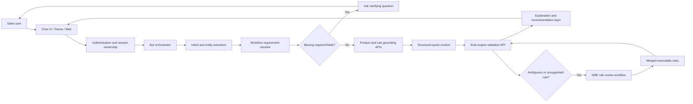
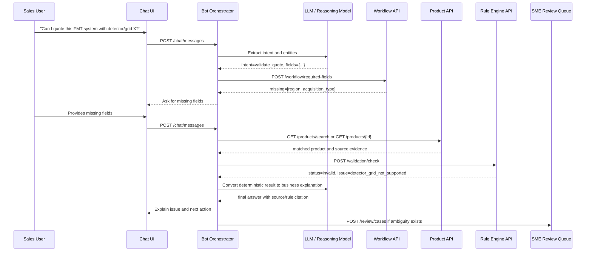
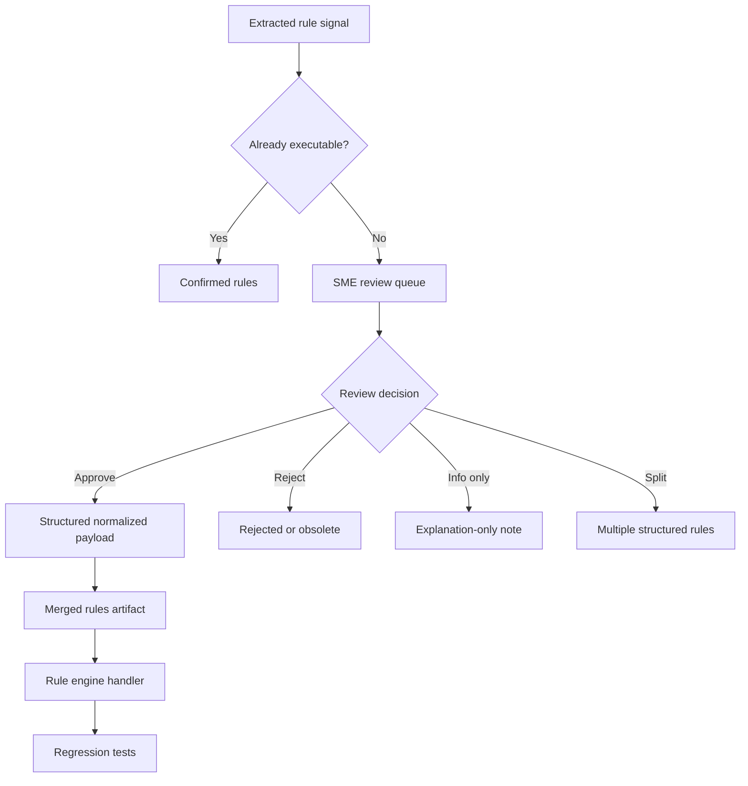
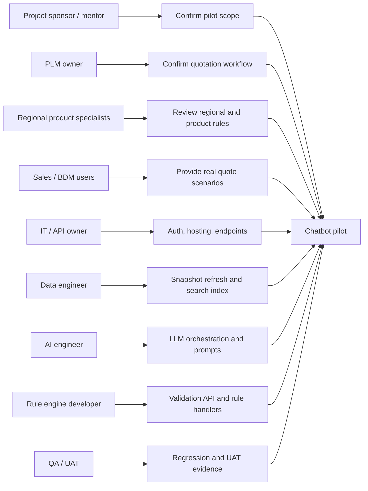
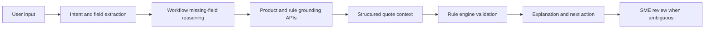

# Quotation Bot Chatbot Implementation Flow

Date: 2026-07-07  
Purpose: Provide an implementation-oriented Markdown plan for building the Quotation Bot as a real chatbot, based on mature enterprise chatbot patterns and the current Quotation Bot repository status.

## 1. Executive Summary

The Quotation Bot should not start as a generic Q&A chatbot. It should be implemented as a guided quotation assistant that can:

- Understand a sales user's quotation request.
- Ask for missing configuration information.
- Ground the request in real quotation product data.
- Build a structured quote context.
- Call deterministic APIs and rule-engine endpoints.
- Explain validation issues in business language.
- Escalate ambiguous rules to human SME review.
- Preserve traceability from bot answer back to source files, rules, and review decisions.

The current project already has a useful MVP foundation:

- `quotation_snapshot.json` is available as the structured data source.
- Product, step option, rule signal, compatibility matrix, detector/grid matrix, and generator/tube matrix data are loadable.
- The current rule engine validates region limits, system compatibility, detector/grid support, and generator/tube specs.
- Rule review files already separate confirmed executable rules from rules needing business review.

The next step is to add the chatbot orchestration layer around the existing data and rule engine.

## 2. Mature Patterns Used as Reference

This plan follows common patterns from mature enterprise chatbot and RAG implementations:

| Reference pattern | Mature practice | How it applies to Quotation Bot |
|---|---|---|
| Enterprise chat architecture | A chat UI calls an application or agent layer, which calls tools, grounding data, model endpoints, and persists conversation state. See Microsoft Foundry chat reference architecture. | Quotation Bot needs a UI/channel, bot orchestrator, LLM, product/rule APIs, state store, and monitoring. |
| Bot turn processing | Bot systems process a user message as an activity/turn, update state, and return one or more responses. See Microsoft Bot Framework concepts. | Each user message should update a quote session and either ask for missing fields or run validation. |
| RAG / grounding | LLM answers should be grounded in private enterprise data through search/retrieval with security and citations. See Azure AI Search RAG guidance. | Product descriptions, step options, rules, and source-cell evidence should be retrievable and cited. |
| Tool / function calling | The model chooses a tool, application code executes it, returns output, and the model produces the final answer. See OpenAI function-calling flow. | The LLM should not invent validation results. It should call product search, workflow, quote-context, and validation endpoints. |
| Human-in-the-loop governance | Ambiguous or high-risk decisions should be reviewed by human SMEs before becoming executable rules. | The existing `rules_needing_review.csv` process should become part of the chatbot escalation and rule lifecycle. |

Useful external references:

- Microsoft Foundry chat reference architecture: https://learn.microsoft.com/en-us/azure/architecture/ai-ml/architecture/baseline-openai-e2e-chat
- Microsoft Bot Framework basics: https://learn.microsoft.com/en-us/azure/bot-service/bot-builder-basics
- Azure AI Search RAG overview: https://learn.microsoft.com/en-us/azure/search/retrieval-augmented-generation-overview
- OpenAI function calling guide: https://developers.openai.com/api/docs/guides/function-calling

## 3. Current Quotation Bot Baseline

### 3.1 Current Data Assets

| Asset | Current count | Role |
|---|---:|---|
| Products | 380 | Product catalog, product IDs, descriptions, comments, source references. |
| Step options | 380 | Options under quotation steps such as FMT/OTC step selections. |
| Rule signals | 984 | Extracted candidate rules from text and matrices. |
| Compatibility matrix | 590 | Structured system compatibility between family, acquisition, stand, wallstand, and table. |
| Detector/grid matrix | 33 | Supported detector and grid combinations. |
| Generator/tube matrix | 69 | Generator and tube specification values. |

### 3.2 Current Rule Engine Coverage

| Rule area | Current behavior | Chatbot implication |
|---|---|---|
| Product region limit | Blocks products outside allowed region. | Bot must ask for region when product IDs are selected. |
| System compatibility | Unsupported combinations become invalid; conditional combinations return warning. | Bot must collect system family, acquisition type, tube stand, wallstand, and table before validation. |
| Detector/grid support | Unsupported detector or position becomes invalid. | Bot must collect grid ID, detector type, and grid position when relevant. |
| Generator/tube specs | Known specs return info; unknown generator/spec becomes invalid. | Bot can explain generator/tube capability and missing specs. |

### 3.3 Current Rule Review State

| Group | Count | Meaning |
|---|---:|---|
| Confirmed rules | 700 | Already represented by current structured data or code paths. |
| Rules needing review | 387 | Candidate rules that need SME confirmation before execution. |

Key review-needed groups include free-text constraints, region exclusions, must-select rules, choose-one rules, feature requirements, detector/bucky matching, and detector/grid matching.

## 4. Proposed End-to-End Chatbot Flow



The important design principle is separation of responsibility:

- The LLM reasons about user language and next action.
- APIs provide product facts, workflow requirements, and deterministic rule results.
- The rule engine decides whether a configuration is valid.
- SMEs decide ambiguous business rules.
- The chatbot explains and guides, but does not invent validation logic.

## 5. Chat Turn Sequence



## 6. Implementation Steps and Required Support

### Step 0 - Confirm the Pilot Scope

Before building the full chatbot, choose a narrow pilot scenario. Recommended pilot:

> Validate a DRX-Compass FMT or OTC quote using product IDs and key configuration fields, then return invalid/incomplete/warning explanations.

What happens:

- Define what the chatbot must handle in the first demo.
- Exclude low-priority features from the first build.
- Agree which outputs are acceptable for tomorrow's or near-term project discussion.

Technical support needed:

- One agreed request/response format for a quote validation request.
- One local or API-accessible rule engine endpoint.
- One source snapshot version.

Business support needed:

- PLM/SME confirms the first product family scope: FMT, OTC, or both.
- Sales/BDM confirms the most common quote questions.
- Mentor or project sponsor confirms presentation scope.

People involved:

| Person / role | Responsibility |
|---|---|
| You | Draft flow, implement MVP, prepare demo and documentation. |
| Mentor | Review architecture framing and make sure the message fits the meeting. |
| PLM owner | Confirm quotation workflow and business meaning. |
| Regional product specialist | Validate local constraints and region-specific rules. |
| IT/API owner | Confirm what systems can expose APIs and what security model is allowed. |

Deliverable:

- A one-page pilot definition with in-scope/out-of-scope and sample user questions.

### Step 1 - Capture User Input

What happens:

- User starts a chat from Teams, web UI, internal portal, or another channel.
- The system creates or resumes a quotation session.
- User message is stored as a conversation turn.

Required technical support:

- Chat channel: Teams bot, web chat, internal portal, or temporary local UI.
- Authentication: Microsoft Entra ID or company SSO.
- Session state store: database table, Cosmos DB, SQL, or application DB.
- Conversation ownership check to prevent one user from accessing another user's session.
- Logging for user message, timestamp, session ID, and response status.

Candidate endpoints:

| Endpoint | Purpose |
|---|---|
| `POST /chat/sessions` | Create a new quote chat session. |
| `GET /chat/sessions/{session_id}` | Resume a previous session. |
| `POST /chat/messages` | Submit a user message and receive bot response. |

Collaboration needed:

- IT/security confirms login and data-retention requirements.
- Sales users confirm preferred channel: Teams vs web.
- Project owner confirms whether chat history can be stored.

### Step 2 - Understand Intent and Extract Fields

What happens:

- The LLM classifies the user request.
- The bot extracts quotation fields from natural language.
- The bot avoids making business decisions at this step; it only parses and structures input.

Typical intents:

| Intent | Example user message |
|---|---|
| `search_product` | "Find the product ID for a DRX-LC grid." |
| `show_product_constraints` | "What constraints does 6703656 have?" |
| `validate_quote` | "Can this FMT quote use Focus 35C with grid 8621989?" |
| `explain_issue` | "Why is this combination invalid?" |
| `continue_quote` | "Use the same region and change the detector." |

Required technical support:

- LLM endpoint or internal AI platform access.
- Prompt template for intent/entity extraction.
- JSON schema for extracted fields.
- Strict tool/function schemas where possible.
- Confidence score and fallback logic when extraction is uncertain.

Candidate endpoint:

```http
POST /nlp/parse
```

Example response:

```json
{
  "intent": "validate_quote",
  "confidence": 0.86,
  "fields": {
    "system_family": "FMT",
    "region": "US",
    "grid_id": "8621989",
    "detector_type": "Focus 35C"
  },
  "missing_likely_fields": ["acquisition_type"]
}
```

Collaboration needed:

- Sales/PLM provides 20-50 real example questions.
- Data/AI engineer builds and tests extraction prompts.
- IT confirms which LLM service is approved for company data.

### Step 3 - Reason Over Missing Requirements

What happens:

- The bot compares extracted fields against the quotation workflow.
- If fields are missing, it asks a targeted clarifying question instead of running incomplete validation.
- The bot should know which fields are required for each rule category.

Quotation-specific requirement examples:

| Validation goal | Required fields |
|---|---|
| Product region validation | `product_ids`, `region` |
| System compatibility validation | `system_family`, `acquisition_type`, `tube_stand_id`, `wallstand_id`, `table_id` |
| Detector/grid validation | `grid_id`, `grid_position`, `detector_type` |
| Generator/tube validation | `generator`, `tube_spec`, optional `spec_category` |

Required technical support:

- Workflow map for FMT and OTC.
- Required-field matrix by validation type.
- Quote session state to remember previously supplied fields.
- Next-question generator.

Candidate endpoints:

| Endpoint | Purpose |
|---|---|
| `GET /workflow/{system_family}` | Return the step map for FMT or OTC. |
| `POST /workflow/required-fields` | Return missing fields for the current quote context. |
| `POST /workflow/next-question` | Generate the next clarifying question. |

Collaboration needed:

- PLM confirms what each quotation step means.
- Regional product specialists confirm if region changes required fields.
- Mentor/project sponsor validates that this workflow is understandable for the meeting audience.

### Step 4 - Ground the Request in Product and Rule Data

What happens:

- The bot searches current product data and maps user language to product IDs.
- It retrieves source evidence from the snapshot.
- It avoids relying only on the LLM's memory.

Required technical support:

- Product search API backed by `quotation_snapshot.json`.
- Optional search index for product descriptions, comments, and aliases.
- Rule lookup by product ID and rule ID.
- Source metadata return: sheet, cell, raw text.

Candidate endpoints:

| Endpoint | Purpose |
|---|---|
| `GET /products/search?q={query}` | Search product catalog. |
| `GET /products/{product_id}` | Retrieve product detail. |
| `GET /products/{product_id}/constraints` | Retrieve product-related constraints. |
| `GET /rules/{rule_id}` | Retrieve rule detail and source evidence. |

Collaboration needed:

- Data owner confirms the latest source file and refresh frequency.
- PLM confirms product synonyms and naming conventions.
- IT/data team confirms whether product data should remain file-based, SQL-based, or search-indexed.

### Step 5 - Build a Structured Quote Context

What happens:

- The bot converts conversation state into a deterministic quote object.
- This object becomes the contract between chatbot, rule engine, UI, and future APIs.

Recommended quote context shape:

```json
{
  "session_id": "quote-session-001",
  "snapshot_version": "2026-07-07",
  "system_family": "FMT",
  "region": "US",
  "acquisition_type": "digital",
  "product_ids": ["6703656"],
  "configuration": {
    "tube_stand_id": "6704522",
    "wallstand_id": "6701585",
    "table_id": "6701676",
    "grid_id": "8621989",
    "grid_position": "table",
    "detector_type": "Focus 43C",
    "generator": "CGN-80",
    "tube_spec": "w/ E7254 & Ray-15_1/RAD-60",
    "spec_category": "output_kw_at_100ma"
  }
}
```

Required technical support:

- Shared JSON schema.
- Field normalization rules.
- Alias tables for region, detector, grid position, and spec categories.
- Version ID for data snapshot and rule set.

Candidate endpoints:

| Endpoint | Purpose |
|---|---|
| `POST /quote-context` | Create a structured quote context. |
| `PATCH /quote-context/{id}` | Update quote context after user adds fields. |
| `GET /quote-context/{id}` | Retrieve current quote state. |

Collaboration needed:

- Backend/API developer defines schema.
- Rule engine developer confirms required fields.
- Sales/PLM confirms field names are understandable.

### Step 6 - Validate with the Rule Engine

What happens:

- The bot calls a deterministic validation endpoint.
- Rule engine returns status, issues, missing fields, rule IDs, and source references.
- The LLM is only used to phrase the result, not to decide the result.

Required technical support:

- API wrapper around `QuotationRuleEngine.check_configuration`.
- Stable validation request/response schema.
- Test coverage for each rule category.
- Error handling for unknown products, incomplete fields, and missing matrix rows.

Candidate endpoint:

```http
POST /validation/check
```

Example response:

```json
{
  "status": "invalid",
  "issues": [
    {
      "severity": "error",
      "code": "detector_grid_not_supported",
      "message": "Grid 8621989 does not support detector Focus 35C.",
      "source": {
        "sheet": "DRX-Compass OTC WW",
        "cell": "..."
      }
    }
  ],
  "missing_fields": []
}
```

Collaboration needed:

- You or developer owns the rule engine API wrapper.
- SME validates that issue messages are business-correct.
- QA/UAT tester prepares real quote examples.

### Step 7 - Explain and Recommend Next Action

What happens:

- The chatbot transforms validation results into a clear business response.
- It explains what is wrong, why it is wrong, and what the user can do next.
- It cites source/rule evidence when available.

Required technical support:

- Explanation templates by issue code.
- LLM prompt that uses only validation output and source evidence.
- Recommendation rules for missing or invalid fields.
- Citation format for source sheet/cell/rule ID.

Candidate endpoints:

| Endpoint | Purpose |
|---|---|
| `POST /explanations` | Convert validation result into user-facing language. |
| `POST /recommendations` | Suggest next action or missing field question. |

Example answer format:

```text
This quote is currently invalid.

Reason: Grid 8621989 does not support detector Focus 35C.

Next action: choose a supported detector for this grid, or change the grid selection.

Source: detector/grid matrix, rule code detector_grid_not_supported.
```

Collaboration needed:

- Sales users review whether answers are understandable.
- PLM confirms issue wording does not overstate business policy.
- Legal/compliance or internal policy owner confirms disclaimers if needed.

### Step 8 - Escalate Ambiguous Rules to SME Review

What happens:

- If the bot finds a candidate rule that is not executable, it creates a review case.
- SME reviews and decides whether the rule should be approved, rejected, split, or treated as info-only.
- Approved rules are merged into the rule artifact and later implemented by the rule engine.

Rule lifecycle:



Required technical support:

- Review queue or reviewed rules file.
- Rule payload schema.
- Merge pipeline.
- Rule engine handler backlog.

Candidate endpoints:

| Endpoint | Purpose |
|---|---|
| `POST /review/cases` | Create a new SME review case. |
| `PATCH /review/cases/{id}` | Update review decision. |
| `POST /rules/merge` | Merge approved rules into executable artifact. |

Collaboration needed:

- SME reviewers own business decisions.
- Developer owns merge validation and rule handler implementation.
- Project owner resolves disagreements or priority conflicts.

### Step 9 - Monitor, Evaluate, and Improve

What happens:

- Every chat turn, tool call, validation result, and review escalation is logged.
- UAT uses real quote examples to check accuracy.
- Failed or unclear conversations become improvement tasks.

Required technical support:

- Observability: Application Insights, Log Analytics, or internal monitoring.
- Audit trail for chat, tool calls, and rule outputs.
- Evaluation dataset with expected answers.
- Cost and latency monitoring for LLM calls.

Candidate metrics:

| Metric | Why it matters |
|---|---|
| Missing-field resolution rate | Measures whether chatbot asks useful clarifying questions. |
| Validation accuracy | Measures whether rule engine output matches SME expectation. |
| Tool-call success rate | Measures API reliability. |
| Average response time | Measures usability. |
| SME escalation rate | Measures unresolved rule ambiguity. |
| Manual checking reduction | Measures business value. |

Collaboration needed:

- UAT users provide feedback and real quote cases.
- IT monitors service health and access logs.
- Data/AI engineer tunes prompts and retrieval behavior.

## 7. Proposed API and Endpoint Catalog

| Domain | Endpoint | Owner | MVP priority | Notes |
|---|---|---|---|---|
| Chat | `POST /chat/sessions` | IT / app developer | High | Create session and bind to user identity. |
| Chat | `POST /chat/messages` | IT / app developer | High | Main chatbot turn endpoint. |
| NLP | `POST /nlp/parse` | AI engineer | High | Intent and entity extraction. |
| Workflow | `GET /workflow/{system_family}` | PLM + developer | High | FMT/OTC step map. |
| Workflow | `POST /workflow/required-fields` | Developer | High | Determine missing fields. |
| Workflow | `POST /workflow/next-question` | AI engineer + PLM | Medium | Generate clarification. |
| Product | `GET /products/search` | Data/API developer | High | Product search from snapshot or index. |
| Product | `GET /products/{product_id}` | Data/API developer | High | Product detail and source. |
| Rules | `GET /products/{product_id}/constraints` | Rule engine developer | Medium | Product-level constraints. |
| Quote | `POST /quote-context` | Backend developer | High | Create structured quote object. |
| Quote | `PATCH /quote-context/{id}` | Backend developer | High | Update quote state. |
| Validation | `POST /validation/check` | Rule engine developer | High | Deterministic rule validation. |
| Explanation | `POST /explanations` | AI engineer | Medium | Convert validation output to business explanation. |
| Review | `POST /review/cases` | SME + developer | Medium | Create human review case. |
| Review | `POST /rules/merge` | Developer | Medium | Merge approved rules into artifact. |
| Monitoring | `GET /analytics/usage` | IT / data team | Low-Medium | Usage, latency, errors, escalation rate. |

## 8. People and Collaboration Model

Because this is a company project, the chatbot cannot be built by one developer alone. The key dependency is not only coding; it is aligning data ownership, business rules, IT security, and UAT.

| Role | Needed from them | When needed | Output |
|---|---|---|---|
| Project sponsor / mentor | Confirm project framing and priority. | Before meeting and before pilot. | Approved scope and communication direction. |
| PLM owner | Confirm quotation workflow and rule meaning. | Step 0-3, then ongoing. | Workflow map and rule decisions. |
| Regional product specialists | Validate region-specific constraints and market rules. | Rule review and UAT. | Region-approved rule interpretations. |
| Sales users / BDM | Provide realistic user questions and test usability. | Pilot and UAT. | Feedback, acceptance criteria, example quotes. |
| IT/API owner | Confirm deployment platform, authentication, endpoint standards, and network access. | Architecture design onward. | API hosting and security model. |
| Data engineer | Own snapshot refresh, search index, and data quality checks. | Data foundation and productionization. | Reliable data pipeline. |
| AI engineer | Own LLM prompt, parsing, tool calling, explanation behavior, and evals. | Chatbot orchestration. | Intent parser, prompt templates, evaluation set. |
| Rule engine developer | Expose validation API and implement new handlers. | MVP and rule expansion. | `/validation/check` and rule handler backlog. |
| QA / UAT owner | Build test scenarios and regression set. | Before pilot launch. | UAT report and pass/fail evidence. |
| Security / compliance | Review data retention, access control, audit, and model usage. | Before pilot with real data. | Security approval and constraints. |

Recommended meeting collaboration:

1. Show the end-to-end flow first, not the code.
2. Ask PLM to confirm whether the workflow steps are correct.
3. Ask IT whether the endpoint model is feasible.
4. Ask sales/BDM for the first 10 real quote questions.
5. Ask SME owners to take responsibility for review-needed rule categories.

## 9. Mermaid View: Team Collaboration Flow



## 10. Delivery Roadmap

| Phase | Goal | Deliverables | Required people |
|---|---|---|---|
| Phase 0 | Align scope | Pilot scenario, first user journeys, in/out of scope. | You, mentor, PLM, sales. |
| Phase 1 | Make current MVP callable | Product search API, validation API, quote context schema. | Developer, IT/API, data engineer. |
| Phase 2 | Add chatbot orchestration | Intent extraction, missing-field reasoning, tool-calling loop. | AI engineer, developer. |
| Phase 3 | Add workflow and explanation | FMT/OTC workflow map, explanation templates, clarifying questions. | PLM, sales users, AI engineer. |
| Phase 4 | Rule review and expansion | Reviewed rules, new handlers for must_select, choose_one, require, region_block. | SME, rule engine developer, QA. |
| Phase 5 | Pilot and UAT | Pilot UI/channel, monitoring, UAT cases, feedback loop. | IT, sales users, QA, sponsor. |

## 11. First Practical Build Recommendation

The first build should be intentionally narrow:

1. Build `POST /validation/check` around the existing `QuotationRuleEngine`.
2. Build `GET /products/search` and `GET /products/{product_id}` from `quotation_snapshot.json`.
3. Define a `QuoteContext` JSON schema.
4. Create a simple chat orchestrator that does:
   - parse user message,
   - identify missing fields,
   - call product/rule endpoints,
   - explain result.
5. Use 10-20 real quote examples from sales/PLM for UAT.

Do not start by building a beautiful UI or a broad agent. Start by proving that the bot can correctly answer a few high-value quotation validation scenarios with traceable rule output.

## 12. Key Decisions Needed from the Company

| Decision | Why it matters | Owner |
|---|---|---|
| Approved chatbot channel | Determines UI, authentication, and deployment. | IT + sponsor |
| Approved LLM platform | Determines data governance and tool-calling capability. | IT/security + AI owner |
| Data source of truth | Determines snapshot refresh and rule traceability. | PLM + data owner |
| First pilot scenario | Prevents overbuilding and keeps scope manageable. | Sponsor + sales + PLM |
| Rule review owners | Required for 387 review-needed rules. | PLM + regional specialists |
| API ownership | Determines who builds and maintains endpoints. | IT/API owner |
| UAT acceptance criteria | Defines whether the bot is good enough to pilot. | QA + sales + sponsor |

## 13. Suggested Closing Message for the Meeting

Quotation Bot should be positioned as a guided quotation assistant, not a generic AI Q&A bot.

The implementation path is:



The current rule engine is a strong starting point, but the complete chatbot needs API support, workflow ownership, product data grounding, SME rule review, authentication, session state, monitoring, and UAT collaboration.
