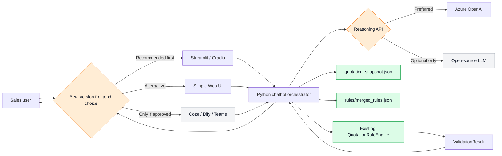
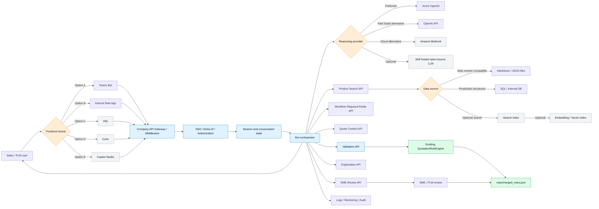

# Quotation Bot Implementation Roadmap

Date: 2026-07-07  
Purpose: This document is a report-style implementation plan. It gives clear conclusions, reasons, phase-by-phase actions, required support, and ownership for building the Quotation Bot from Beta version to production.

## 1. Executive Conclusion

### Conclusion

The path is to build Quotation Bot in two versions:

1. **Beta version first**: use a lightweight frontend, Azure OpenAI, existing JSON/Markdown files, and the rule engine that is already implemented.
2. **Production later**: add enterprise frontend, internal APIs, authentication, persistent memory, monitoring, SME rule review workflow, optional search index, optional embedding, and optional database.

### Current asset

The existing rule engine is the core backend asset.

It already supports:

- Product region validation.
- System compatibility validation.
- Detector / grid validation.
- Generator / tube specification validation.
- Rule review artifacts and merged rule JSON preparation.

The next technical action is:

> Wrap the existing `QuotationRuleEngine` as `POST /validation/check` so any frontend, chatbot platform, or orchestrator can call it.

## 2. Beta version Target Architecture

### Conclusion

The Beta version should be a small internal demo that proves the bot can take a quote question, extract fields, call the existing rule engine, and return a clear result.

### Beta version flow



### Beta version should not include yet

| Not included in Beta version | Status |
|---|---|
| Full production UI | Production version item |
| Full database design | Production version item |
| Embedding/vector search | Optional later item |
| Broad rule automation | SME review required first |
| External SaaS bot as default | Approval required first |

## 3. Production Target Architecture

### Conclusion

The production version should be API-centered. The frontend can be Teams, internal Web App, Dify, Coze, or Copilot Studio, but all quote data, rule validation, and governance should stay behind company-controlled APIs.

### Production flow



## 4. Phase-by-Phase Implementation Plan

## Phase 0 - Align Scope and Access

### Conclusion

Before building more UI, confirm the pilot scenario, Azure OpenAI access, and data usage boundary.

### What to do

1. Define the first pilot scenario.
2. Confirm Azure OpenAI endpoint and model access.
3. Confirm whether quotation/product/rule data can be sent to Azure OpenAI.
4. Confirm whether the first demo runs locally, on an internal server, or behind an API gateway.

### Required support

| Support needed | From whom |
|---|---|
| Azure OpenAI endpoint, deployment name, API version | IT / AI platform team |
| Data usage approval | IT / security / data owner |
| Pilot business scenario | Mentor, PLM, Sales / BDM |
| First 10-20 real cases | Sales / PLM |

### Deliverable

- One-page pilot scope.
- Approved model/API access path.
- Initial test question set.

## Phase 1 - Build Beta version Chat Interface

### Conclusion

Use Streamlit as fronted first.

### What to do

1. Build a local chat UI.
2. Allow user to input a quote/configuration question.
3. Display extracted fields, validation result, and explanation.
4. Use session state only for the current conversation.

### Required support

| Support needed | From whom |
|---|---|
| Approval to run internal demo | Mentor / sponsor |
| Azure OpenAI credentials or approved access method | IT / AI platform |
| Demo questions | Sales / PLM |

### Deliverable

- Working Beta version UI.
- Demo flow: user question -> extracted fields -> validation -> explanation.

## Phase 2 - Connect Reasoning Layer

### Conclusion

Use Azure OpenAI as the preferred reasoning layer. Use open-source LLM only if Azure OpenAI is unavailable or policy requires self-hosting.

### What to do

1. Use Azure OpenAI for intent extraction.
2. Use Azure OpenAI for field extraction.
3. Use Azure OpenAI for explanation wording.
4. Do **not** use Azure OpenAI as the final validation authority.

### Reasoning API options

| Option | Open-source? | Recommendation |
|---|---:|---:|---|
| Azure OpenAI | No | **Recommended first** |
| OpenAI API | No | Only if approved |
| Dify-connected model | Dify can be self-hosted; models vary | Later option |
| Open-source LLM | Some models open-weight | Not first choice |

### Required support

| Support needed | From whom |
|---|---|
| `AZURE_OPENAI_ENDPOINT` | IT / AI platform |
| Deployment name and API version | IT / AI platform |
| Authentication method | IT / security |
| Allowed data scope | Security / data owner |
| Quota / rate limit | IT / AI platform |

### Deliverable

- `parse_intent_and_fields()` function or service.
- Prompt/template for structured extraction.
- Explanation prompt that only uses rule-engine output.

## Phase 3 - Use Existing Rule Engine as Validation Authority

### Conclusion

The existing rule engine should remain the validation authority. The chatbot should call it; it should not recreate validation inside the LLM.

### What to do

1. Keep using `QuotationRuleEngine` for deterministic validation.
2. Load `quotation_snapshot.json` and `rules/merged_rules.json`.
3. Convert parsed user input into structured validation input.
4. Return `valid`, `invalid`, `incomplete`, warning, and info results.

### Current rule engine capability

| Existing capability | Status |
|---|---|
| Product region validation | Implemented |
| System compatibility validation | Implemented |
| Detector / grid validation | Implemented |
| Generator / tube spec validation | Implemented |

### Required support

| Support needed | From whom |
|---|---|
| Rule engine API wrapper | Developer / Intern |
| Business validation of messages | PLM / SME |
| Regression test cases | QA / Sales / PLM |

### Deliverable

```http
POST /validation/check
```

This is the first endpoint that should be productionized.

## Phase 4 - Keep Beta version Data Simple

### Conclusion

For Beta version, read data directly from JSON and Markdown.

### What to do

1. Continue using `quotation_snapshot.json` as the product/data source.
2. Continue using `rules/merged_rules.json` as the rule artifact.
3. Use Markdown docs for implementation notes and workflow explanation.
4. Add database/search only when the pilot needs multi-user access, refresh control, audit, or performance.

### Data decision

| Data option | Beta version decision | Production decision |
|---|---|---|
| JSON files | Use now | Can continue if controlled |
| Markdown files | Use for docs/planning | Optional for knowledge docs |
| SQL/internal DB | Not required now | Add if needed |
| Search index | Optional | Add if search quality needs it |
| Embedding/vector index | Optional | Add only if semantic search is needed |

### Deliverable

- File-based Beta version data loader.
- Clear decision that database/search/embedding are later-stage options, not Beta version blockers.

## Phase 5 - Add Minimal Memory

### Conclusion

The bot needs short-term session memory for multi-turn conversations. Long-term memory is not required for Beta version.

### What to do

1. Store current quote fields during a session.
2. Remember missing fields already asked.
3. Reset or export session after the demo.
4. Avoid storing long-term chat history until IT/security approves retention policy.

### Memory decision

| Memory type | Beta version decision | Production decision |
|---|---|---|
| Current session memory | Required | Required |
| Cross-session history | Optional | Recommended if audit/resume is needed |
| Long-term user preference | Not needed | Optional |
| Quote analytics history | Not needed | Optional |

### Required support

| Support needed | From whom |
|---|---|
| Chat history retention decision | IT / security |
| Session schema | Developer |
| User identity model | IT / security |

### Deliverable

- Beta version session state in Streamlit/Gradio or local Python object.
- Production recommendation for SQL/Cosmos/Redis only after pilot approval.

## Phase 6 - Expose Company APIs

### Conclusion

After Beta version works locally, convert the useful functions into company-owned APIs. This is the main step that enables Coze, Dify, Teams, Copilot Studio, or internal Web App frontends.

### What to do

1. Build `POST /validation/check` first.
2. Build product search API.
3. Build quote context API.
4. Build workflow required-fields API.
5. Add review case API after SME workflow is agreed.

### Endpoint priority

| Priority | Endpoint | Required support |
|---:|---|---|
| 1 | `POST /validation/check` | Rule engine developer |
| 2 | `GET /products/search` | Data/API developer |
| 3 | `GET /products/{product_id}` | Data/API developer |
| 4 | `POST /quote-context` | Backend developer |
| 5 | `POST /workflow/required-fields` | PLM + developer |
| 6 | `POST /nlp/parse` | AI engineer |
| 7 | `POST /review/cases` | SME + developer |

### Deliverable

- Internal API contract.
- Endpoint owner list.
- First callable validation endpoint.

## Phase 7 - Decide Production Frontend

### Conclusion

Frontend should be replaceable.

### What to do

1. Use Streamlit for Beta version.
2. After APIs are ready, evaluate Teams, internal Web App, Dify, Coze, or Copilot Studio.
3. Choose production frontend based on company security, licensing, deployment, and user adoption.

### Frontend recommendation

| Stage | Recommended frontend |
|---|---|
| Beta version | Streamlit / Gradio |
| Pilot | Streamlit, internal Web App, or approved Teams bot |
| Production | Teams / internal Web App / approved Dify or Copilot Studio |

### Deliverable

- Frontend decision after API contract is reviewed.

## Phase 8 - SME Rule Review and Expansion

### Conclusion

The rule engine is implemented, but not every extracted rule should be automated immediately. The 387 review-needed rules require SME ownership.

### What to do

1. Assign SME owners for review-needed rule categories.
2. Review free-text constraints and region exclusions first.
3. Normalize approved rules into structured payloads.
4. Add rule engine handlers for approved types.

### Required support

| Support needed | From whom |
|---|---|
| Rule review owner | PLM / SME |
| Regional validation | Regional product specialists |
| Handler implementation | Developer |
| Regression tests | QA / developer |

### Deliverable

- Reviewed rules.
- Expanded rule handlers.
- Updated `rules/merged_rules.json`.

## Phase 9 - Pilot and UAT

### Conclusion

Pilot should validate a few high-value quote scenarios, not the entire product universe.

### What to do

1. Select 10-20 real quote questions.
2. Run them through the Beta version.
3. Compare bot output with SME expectation.
4. Record false positives, false negatives, missing fields, and unclear explanations.
5. Improve prompts, workflow fields, and rule handlers.

### Required support

| Support needed | From whom |
|---|---|
| Real quote cases | Sales / PLM |
| Expected answers | SME / PLM |
| UAT tracker | QA / project owner |
| Improvement owner | Developer / AI engineer |

### Deliverable

- UAT result table.
- Go/no-go recommendation for pilot expansion.

## 5. Final Recommended Roadmap

| Phase | What to do | Required support | Deliverable |
|---|---|---|---|
| 0 | Confirm scope and access | Mentor, IT, PLM, Sales | Pilot scope and access approval |
| 1 | Build Streamlit/Gradio Beta version | You, mentor, Sales examples | Local demo |
| 2 | Connect Azure OpenAI | IT / AI platform | LLM parse/explain function |
| 3 | Use existing rule engine | Developer / you, PLM | Working validation flow |
| 4 | Use JSON/Markdown data | Data owner | File-based Beta version data |
| 5 | Add session memory | Developer, IT/security | Session quote context |
| 6 | Expose APIs | IT/API, developer | API contract and `/validation/check` |
| 7 | Choose production frontend | Sponsor, IT, users | Frontend decision |
| 8 | Review rules with SMEs | PLM, regional specialists | Approved rule payloads |
| 9 | Run UAT | Sales, PLM, QA | UAT evidence |

## 6. Final Recommendation for the Report

The recommended implementation is:

1. **Use Azure OpenAI** for intent extraction and explanation.
2. **Use Streamlit or Gradio first** for the Beta version frontend.
3. **Read JSON and Markdown directly for Beta version**.
4. **Keep the existing rule engine as the validation authority**.
5. **Expose `POST /validation/check` as the first internal API**.
6. **Add database, embeddings, search index, and formal frontend after Beta version proves value**.

Final principle:

> Frontend can change. Reasoning provider can change. Data store can evolve. The existing rule engine should remain the deterministic validation authority.
