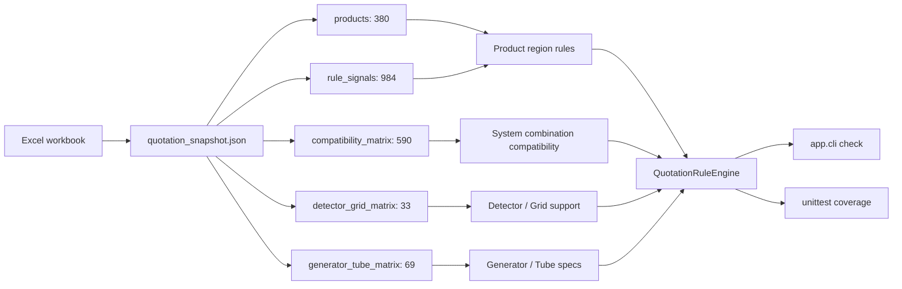
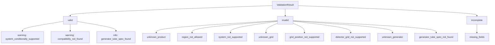
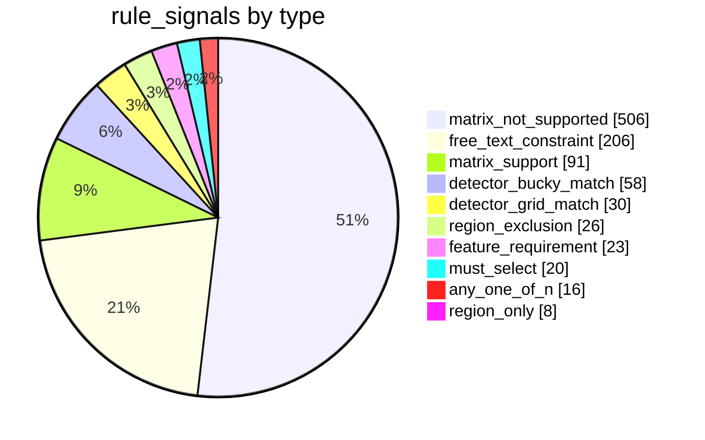
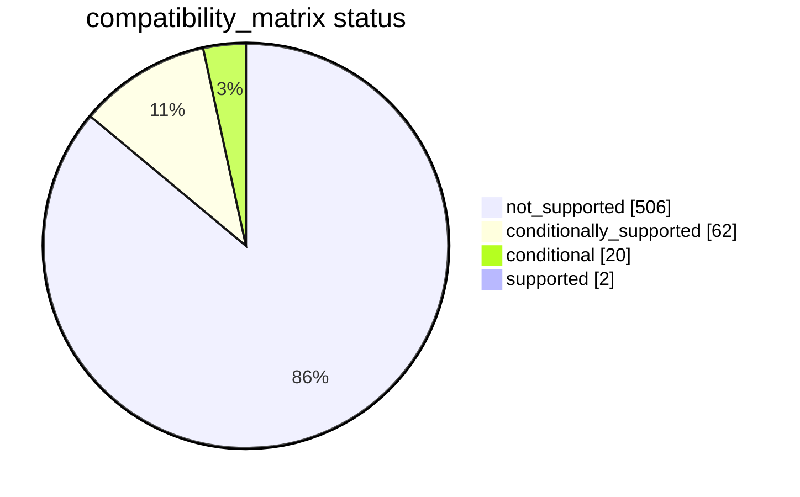
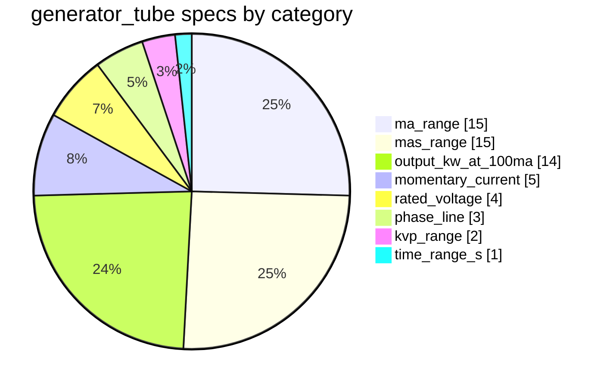
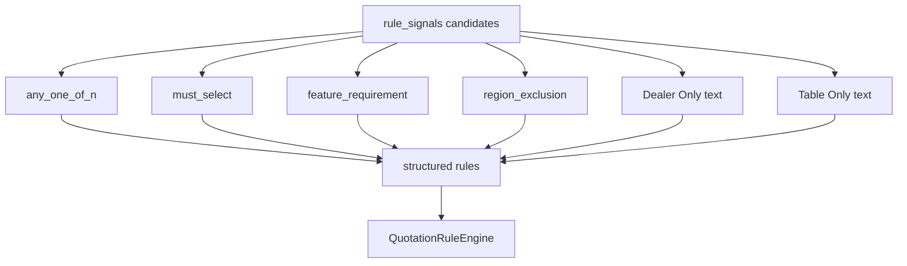

# Quotation Bot Rule Inventory

Generated from the current `quotation_snapshot.json` and implemented rule engine code.

## Rule Map



## Implemented Rule Categories

| Category | Data source | Main input fields | Current behavior | Example |
|---|---|---|---|---|
| Product region limit | `rule_signals`, `products` | `product_ids`, `region` | Blocks products whose text rule says a product is limited to specific regions. | Product `6703656` is valid in `US`, invalid in `EU` because it is `US & C Only`. |
| System combination compatibility | `compatibility_matrix` | `system_family`, `acquisition_type`, `tube_stand_id`, `wallstand_id`, `table_id` | `not_supported` becomes `invalid`; `conditional` and `conditionally_supported` become warning; `supported` passes. | `FMT + digital + 6704522 + 6701585 + 6701676` is `system_not_supported`. |
| Detector / Grid support | `detector_grid_matrix` | `grid_id`, `grid_position`, `detector_type` | Blocks unsupported grid positions or detector types. | Grid `8621989` supports `table` and `Focus 43C`; it does not support `wall` or `Focus 35C`. |
| Generator / Tube specs | `generator_tube_matrix` | `generator`, `tube_spec`, optional `spec_category` | Returns recorded specs as `info`; unknown generator or missing recorded spec is `invalid`. | `CGN-80 / output_kw_at_100ma / w/ E7254 & Ray-15_1/RAD-60 = 80`. |

## Implemented Rule Output Codes



## Snapshot Data Volume

| Snapshot field | Count | Role |
|---|---:|---|
| `products` | 380 | Product catalog and product comments. |
| `step_options` | 380 | Product option steps and option groups. |
| `rule_signals` | 984 | Candidate natural-language and matrix-derived rules. |
| `compatibility_matrix` | 590 | System combination compatibility. |
| `detector_grid_matrix` | 33 | Grid support by position and detector type. |
| `generator_tube_matrix` | 69 | Generator/tube specification values. |

## Candidate Rule Signals

These are present in `quotation_snapshot.json`. Some are already consumed by the rule engine; others are still candidates for later normalization.



| Rule signal type | Count | Current status | Notes |
|---|---:|---|---|
| `matrix_not_supported` | 506 | Implemented through `compatibility_matrix` | Hard blocks for unsupported system combinations. |
| `matrix_support` | 91 | Partially implemented through `compatibility_matrix` | Conditional/support signals are returned as warning or pass. |
| `free_text_constraint` | 206 | Partially implemented for region-only text | Needs review before converting more text into hard rules. |
| `region_only` | 8 | Partially implemented | Used when region list and `Only` semantics are clear. |
| `region_exclusion` | 26 | Candidate | Should become `region_block` or `region_allow` after review. |
| `feature_requirement` | 23 | Candidate | Likely maps to `require` rules. |
| `must_select` | 20 | Candidate | Likely maps to mandatory option rules. |
| `any_one_of_n` | 16 | Candidate | Likely maps to option group cardinality rules. |
| `detector_bucky_match` | 58 | Candidate | May become detector/bucky compatibility checks. |
| `detector_grid_match` | 30 | Partially implemented through `detector_grid_matrix` | Existing implementation checks detector/grid support table. |

Review status distribution:

| Review status | Count |
|---|---:|
| `auto_approved` | 667 |
| `needs_review` | 317 |

## Product Region Rule Examples

| Product | Regions parsed | Message | Engine effect |
|---|---|---|---|
| `6703656` | `US`, `C` | Fit Branding Kits are for Dealer Only and always include with Parts Warranty Only Systems Currently US & C Only | Blocks non-US/non-Canada regions. |
| `6704456` | `US`, `C` | Fit Branding Kits are for Dealer Only and always include with Parts Warranty Only Systems Currently US & C Only | Blocks non-US/non-Canada regions. |
| `8620148` | `US`, `C` | US & C Market Only All system detector must be Focus if selected | Region part is handled; detector requirement is still a candidate rule. |
| `8625246` | `US`, `C` | US & C Market Only. All system detector must be DRX Plus or Focus HD if selected. Does not match 44LINE/CM Grids | Region part is handled; detector/grid text should be normalized later. |
| `6701585` | `C` | WallStand-T Z-MOTORIZED w/o Bucky C/F | Candidate for careful review because the text does not explicitly say `Only`. |

## System Compatibility Matrix



| Status | Count | Engine effect |
|---|---:|---|
| `not_supported` | 506 | `invalid`, code `system_not_supported` |
| `conditionally_supported` | 62 | `valid` with warning `system_conditionally_supported` |
| `conditional` | 20 | `valid` with warning `system_conditionally_supported` |
| `supported` | 2 | `valid` |

Example unsupported combination:

| Field | Value |
|---|---|
| `system_family` | `FMT` |
| `acquisition_type` | `digital` |
| `tube_stand_id` | `6704522` |
| `wallstand_id` | `6701585` |
| `table_id` | `6701676` |
| Engine code | `system_not_supported` |

## Detector / Grid Support

Supported dimensions are inferred from the source sheet columns:

| Kind | Supported names |
|---|---|
| Position | `Table`, `Wall` |
| Detector | `DRX Plus/Lux`, `Focus 35C`, `Focus 43C`, `Focus HD`, `DRX LC` |

Grid rows represented in the current snapshot:

| Grid ID | Number of support marks |
|---|---:|
| `8621997` | 5 |
| `8622029` | 5 |
| `8621989` | 4 |
| `8622011` | 4 |
| `6701718` | 3 |
| `8622052` | 3 |
| `6701700` | 2 |
| `8622037` | 2 |
| `8622045` | 2 |
| `8622060` | 2 |
| `6708366` | 1 |

Example:

| Grid | Position / detector | Result |
|---|---|---|
| `8621989` | `table` | Supported |
| `8621989` | `Focus 43C` | Supported |
| `8621989` | `wall` | `grid_position_not_supported` |
| `8621989` | `Focus 35C` | `detector_grid_not_supported` |

## Generator / Tube Specs

The generator/tube sheet is treated as a specification table, not a pure hard support matrix.



| Spec category | Meaning | Example |
|---|---|---|
| `phase_line` | Phase line | `CGN-80 = 3-Phase` |
| `rated_voltage` | Rated voltage | `CGN-80 = 380/400/480V` |
| `momentary_current` | Momentary current | `CGN-80 = 166A 158A 143A` |
| `output_kw_at_100ma` | Output at 100mA | `CGN-80 / w/ E7254 & Ray-15_1/RAD-60 = 80` |
| `kvp_range` | kVp range | `CGN-80 / w/ E7254 & Ray-15_1/RAD-60 = 40-150` |
| `ma_range` | mA range | `CGN-80 / w/ E7254 & Ray-15_1/RAD-60 = 10-1000` |
| `mas_range` | mAs range | `CGN-80 / w/ E7254 & Ray-15_1/RAD-60 = 0.1-1000` |
| `time_range_s` | Time range in seconds | `CGN-80 = 0.001-6.3` |

## Current CLI Examples

Region limit:

```powershell
python -m app.cli check --region EU --product-id 6703656
```

System compatibility:

```powershell
python -m app.cli check --system-family FMT --acquisition-type digital --tube-stand-id 6704522 --wallstand-id 6701585 --table-id 6701676
```

Detector / grid support:

```powershell
python -m app.cli check --grid-id 8621989 --grid-position wall --detector-type "Focus 35C"
```

Generator / tube specs:

```powershell
python -m app.cli check --generator CGN-80 --tube-spec "w/ E7254 & Ray-15_1/RAD-60" --spec-category output_kw_at_100ma
```

## Next Rule Normalization Targets



Suggested next structured rule types:

| Target type | Source examples | Proposed engine behavior |
|---|---|---|
| `choose_one` | `Any one of the 2` | Enforce min/max selected options inside a step group. |
| `must_select` | `must_select` rule signals | Require a product/option when a condition is present. |
| `require` | `feature_requirement` | Require detector, table, wallstand, warranty, or channel features. |
| `region_block` | `region_exclusion` | Block explicit excluded markets. |
| `channel_constraint` | `Dealer Only` | Validate sales channel once channel is part of the input model. |
| `mount_constraint` | `Table Only`, `WallStand Only` | Validate table/wallstand or system mount once normalized. |